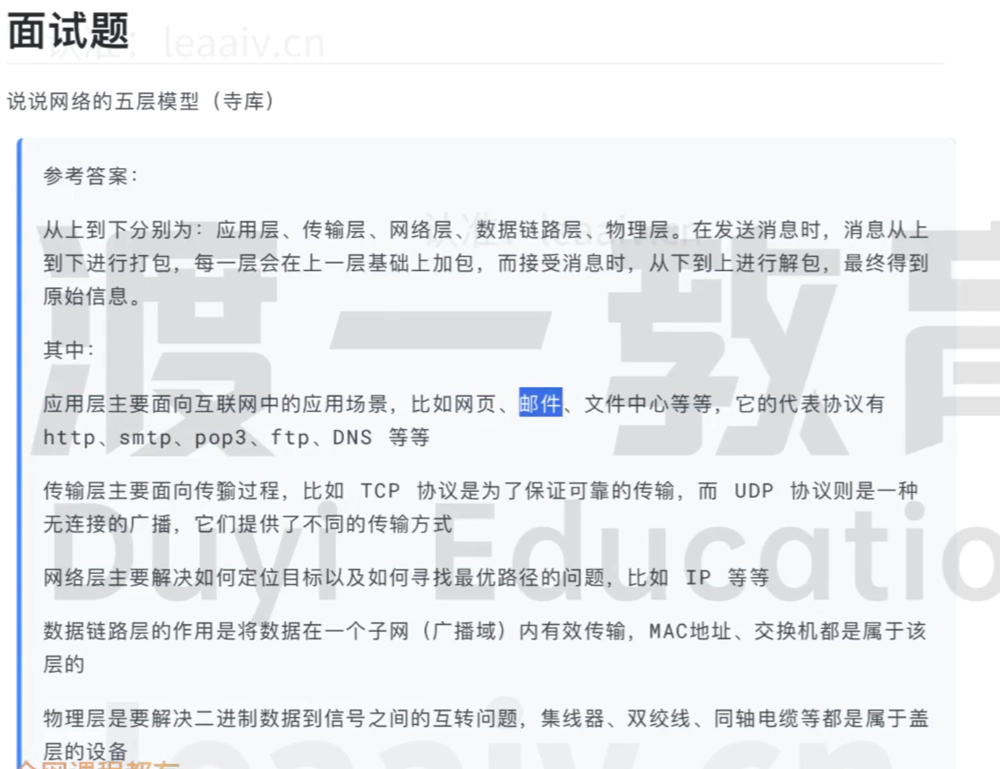

# 谈谈网络的五层模型
*  网络的五层模型分别是哪五层？分别解决了哪些问题？每一层次对应的协议有哪些？
    答：五层分别是：应用层、传输层、网络层、数据链路层、物理层。
    * 应用层：解决通过应用进程的交互来实现特定网络应用的问题/用于确定某个具体应用的消息格式。代表协议有HTTP、DNS、FTP、SMTP、POP等等。
    * 传输层：解决进程间基于网络的通信问题/保证消息的可靠性。代表协议有TCP、UDP
    * 网络层：解决数据包在多个网络间传输和路由的问题/解决如何在互联网中找到对方。代表协议有IP协议等。
    * 数据链路层：解决数据包在同一个网络或一段链路上传输的问题/解决如何在一个子网中找到对方。
    * 物理层：解决用何种信号来表示数据。

* 在网络传输过程中，每一层分别用到的物理设备有哪些？
    * 应用层：任何需要网络请求的物理设备
    * 传输层：L4 switch
    * 网络层：路由器
    * 数据链路层：交换机
    * 物理层：光纤，双绞线

* 谈谈数据的封装和解封装过程
    答：应用层添加一个http头部(http请求头)--->传输层添加一个tcp/udp头部(源端口号，目的端口号)--->网络层添加一个ip头(源ip地址，目的ip地址)--->数据链路层添加一个头部一个尾部(源MAC地址，目的MAC地址)--->物理层根据传输设备将数据转化成相应的信号--->物理层还原信号--->数据链路层去掉一个头部和尾部确定mac地址--->网络层去掉ip头确定ip地址--->传输层去掉tcp头确定端口--->应用层去掉http头接收数据

* 计算机网络架构模型有哪几种？每一种分别有几层？每层分别是什么？
    答：有三种模型，分别是TCP/IP四层网络模型，OSI七层网络模型，TCP/IP五层网络模型。四层模型对应：应用层、传输层、网络层、物理链路层。七层模型对应：应用层、表示层、会话层、传输层、网际层、数据链路层、物理层

* **(面试题一)谈谈网络的五层模型**
    * 答：
        
