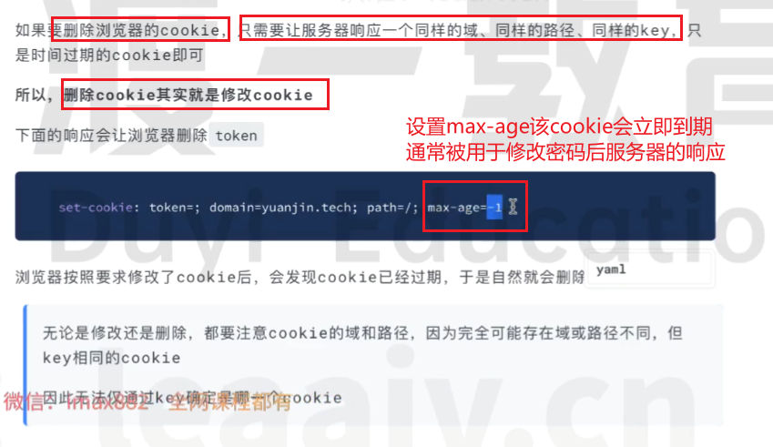
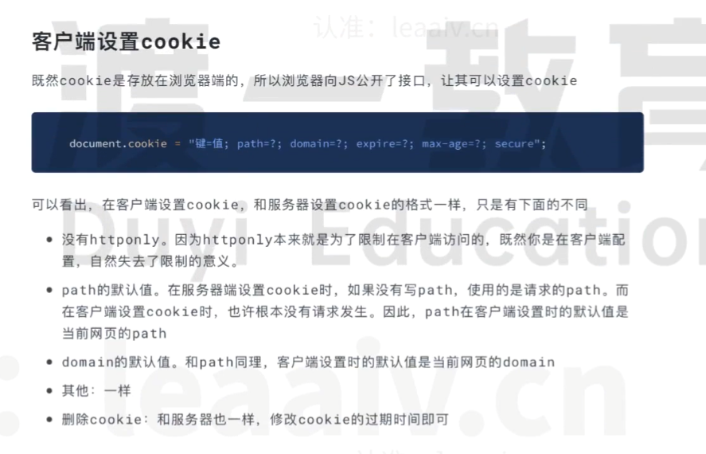
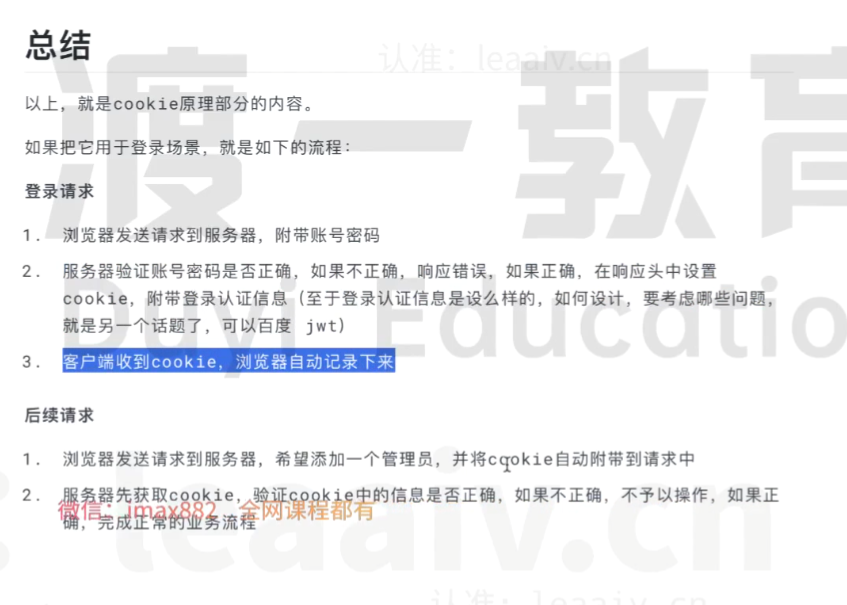
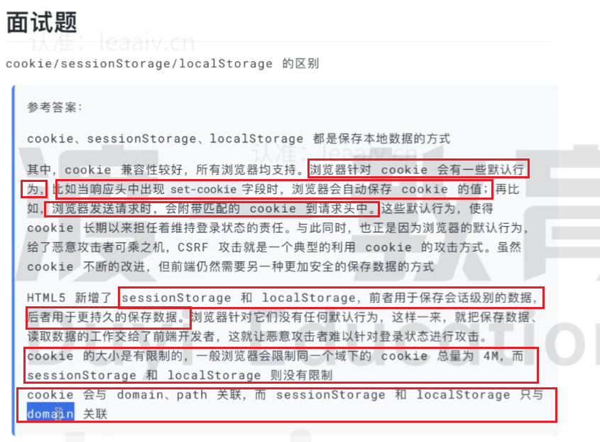

# Cookie相关
* 什么是cookie？/cookie有何作用？（面试题1）
    * 答：由于客户端和服务器的传输是使用http协议，http协议是无状态的。因此cookie定义如下：
        1. 当用户通过浏览器访问登录一个网站服务器时，服务器会给你发一些证件，这些证件记录着该用户访问该服务器的一些信息及状态，当下次该用户再次访问该网站服务器时携带这些证件，就可以直接访问并自动登录，可以轻松识别身份。不同的服务器发送不同的证件，一个服务器可能发送多张证件，每张证件都代表着一个cookie，这些证件统一由用户的浏览器进行管理，用户浏览器相当于一个卡包装着这些证件，并有一套机制自动管理这些证件。
        2. 简而言之，Cookie是一种小型的文本文件，由网站服务器发送到用户的浏览器，并存储在用户的计算机上。它包含了一些网站相关的信息，如用户的偏好设置、登录状态、购物车内容等。

* 浏览器管理Cookie，具备以下功能：
    1. 能存放多个证件
    2. 能自动出示证件
    3. 正确的出示证件
    4. 管理证件的有效日期

* Cookie的组成
    * key：cookie名字
    * value：cookie中的内容
    * domain：域，表示这个cookie是属于哪个网站的，比如.baidu.com表示该cookie是属于百度这个网站的。
    * path：路径，表达这个cookie是属于网站的哪个基路径的。
    * secure：安全传输
    * expire：cookie过期时间

* 访问一个网站服务器时，如何知道携带哪个cookie放入请求头中去访问？需要满足四个条件。（面试题2）
    * cookie没有过期
    * cookie中的域和这次请求的域是匹配的
        * 本域及其子域可以匹配。
        * 如果某个cookie的域是.baidu.com(主域)，那么可以匹配的请求域为www.baidu.com 或xxx.baidu.com 
        * 如果访问的是子域,如www.baidu.com,则只能访问www.baidu.tech这样的请求域。
    * cookie中的path和这次请求的path是匹配的
        比如cookie中的path为/news,则可以匹配的请求路径是/news,/news/detail,/news/a/b/c,但是不能匹配/blogs,根路径'/'也会匹配
    * 验证cookie的安全传输
        * 如果cookie的secure属性是true，则请求协议必须https，否则不会发送该cookie
        * 如果cookie的secure属性是false，则请求的协议可以是http，也可以是https

* 如何设置cookie？（了解）
    * 服务器响应（理解原理）
        1. 如果客户端通过post请求服务器http://www.baidu.com/login，在请求体中给定了账号和密码
        2. 服务器拿到请求，验证成功后，在响应头中添加下述cookie内容：
            ```
            set-cookies:token=123456;path=/;max-age=3600;httponly
            ```
        3. 浏览器接收到响应后，解析响应头并记录cookie
            ```
            key:token
            value:123456
            domain:baidu.com
            path:/
            expire:相对于当前时间的3600ms后
            secure：false
            httponly:true  //不允许JS获取该Cookie
            ```
        4. 对于后续浏览器对服务器的请求，只要满足要求，这个cookie就会被附带到请求头中传给服务器进行验证。
        5. 删除cookie
            * 手动在浏览器删除
            * 
    * 客户端自行设置
        
* 总结
    


* **(面试题一)cookie/sessionStorage/localStorage区别？**
    * sessionStorage：会话数据，浏览器关闭则消失；H5时出现
    * localStorage：长久保存
    * 
        


