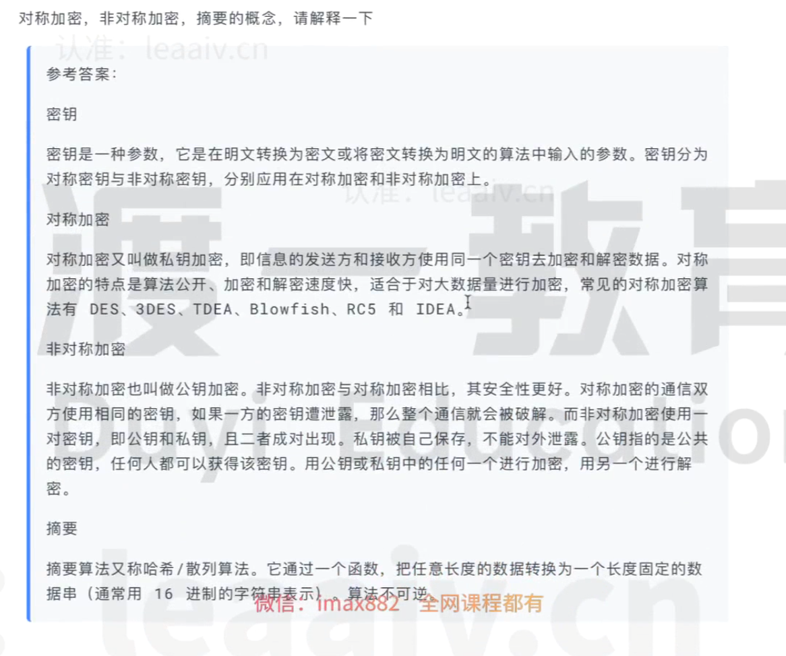

# 1. 对称加密、非对称加密、摘要概念（了解）
* 
# 2. jwt
* 什么是jwt？
    * 答： JWT全称Json Web Token,本质是一个字符串。它主要用于在互联网环境中，提供统一的、安全的令牌格式。可以将jwt存储到cookie、localstorage中，没有任何限制。
* 令牌的组成
    * header：令牌头部，记录整个令牌的类型和签名算法。它的格式是一个json对象:
        ```
            {
                "alg":"HS256",  //对称加密算法
                "typ":"JWT"    //类型
            }
        ```
    * payload：令牌负荷，记录了保存的主体信息，比如要保存的用户信息就可以放这。它的格式也是一个json对象
    * signature：令牌签名，按照头部固定的算法对整个令牌进行签名，作用是保证令牌不被伪造和篡改。这部分的生成，是对前面两个部分的编码结果，按照头部指定的方式进行加密。（服务端 加密）
    * 比如一个完整的令牌：fwagwaegwwgrwwa24t345y4h3.sggw24geg3434g4wg42h.wegwh43yu5j3t
        * header:fwagwaegwwgrwwa24t345y4h3(base 64编码)
        * payload:sggw24geg3434g4wg42h(base 64编码)
        * signature:wegwh43yu5j3t(真正的令牌加密部分)
* (面试题一)请阐述JWT的令牌格式
* 答：token分为三段，分别是header，payload，signature。其中，header标识签名算法和令牌类型；payload标识主体信息，包含令牌过期时间、发布时间、发行者、主体内容等。signature是使用特定的算法对前面两部分进行加密，得到的加密结果。token有防篡改的特点，如果攻击者改动了前面两个部分，就会导致和第三部分对应不上，使得token失败。而攻击者不知道加密密钥，因此无法修改第三部分的值。所以，在密钥不泄露的前提下，一个验证通过的token是值得被信任的。