# 同源策略
* 引入：浏览器有一个重要的安全策略，称之为同源策略，其中，源=协议+主机+端口。两个源必须相同才能称为同源，两个源不同则称为跨源或跨域。
* 定义：同源策略是指，若页面的源和页面运行过程中加载的源不一致时，处于安全考虑，浏览器会对跨域的资源访问进行一些限制。
* 注意：同源策略对于ajax的跨域限制最为凶狠，默认情况下，不允许ajax访问跨域资源。因此，通常情况下，所说的跨域问题就是指同源策略对ajax产生的影响。
* 解决跨域问题的方法：（目的都是让浏览器知道跨域请求的是自己人，不要进行拦截）
    * 1. 代理
    * 2. CORS
    * 3. JSONP

# 跨域-代理
* 介绍：对于前端开发而言，大部分的跨域问题，都可以通过代理来解决。
* 适用场景：**生产环境不发生跨域，但开发环境发生跨域**，因此只需要在开发环境中使用代理解决跨域即可，这种代理又称为开发代理。
* 使用：通过设置代理，让ajax访问的资源先通过本机服务器进行代理转发，就可以避免跨域问题。只需要对开发服务器稍加配置即可。    
    * 添加配置：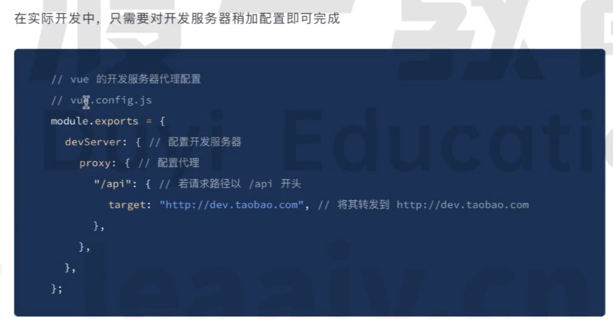  

# 跨域-CORS
* 介绍：CORS——Cross-Origin-Resource-Sharing(跨域资源共享)
* 总体思路：如果浏览器想要跨域访问服务器的资源，需要获得服务器的允许
* CORS的三种不同交互模式(根据每个请求对服务器造成的不同程度的影响)：
    * 1. 简单请求
    * 2. 需要预检的请求
    * 3. 附带身份凭证的请求
* 简单请求：
    * 注意：当浏览器运行一段ajax代码时浏览器首先会判断这个请求属于哪一种请求模式
    * 当满足以下几个要求时，浏览器会认为这个一个简单请求:
        * 1. **请求方法**属于下面的一种
            * get
            * post
            * head
        * 2. **请求头**仅包含安全的字段，常见的安全字段如下：
            * accept
            * accept-language
            * content-language
            * content-type
            * DRP
            * Downlink
            * Sava-Data
            * Viewport-Width
            * Width
        * 3. 请求头如果包含**Content-Type**,仅限下面的值之一：
            * text/plain
            * multipart/form-data
            * application/x-www-form-urlencoded
    * 简单请求的交互规范
        * 1. 请求头自动添加Origin字段
            * 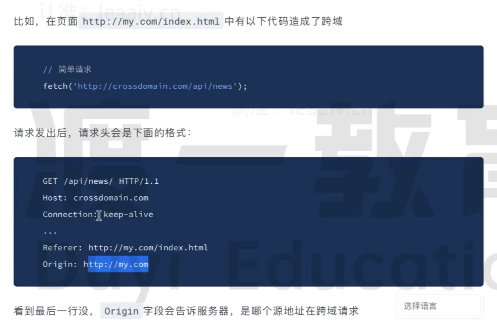
        * 2. 服务器响应头中包含有Access-Control-Allow-Origin 
            * 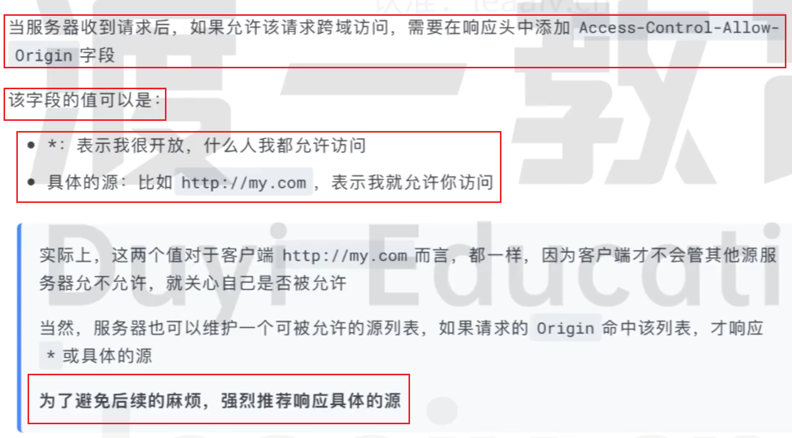
        * 3. 当浏览器看到服务器允许访问后，就顺利将响应交给js，以完成后续操作。
* 需要预检的请求
    * 介绍：当浏览器认为一个请求不是简单请求时，就要执行以下流程
        * 1. 浏览器发送预检请求，询问服务器是否允许
            * 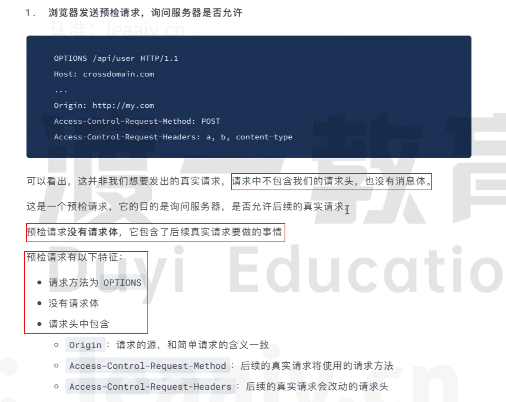
        * 2. 服务器允许
            * 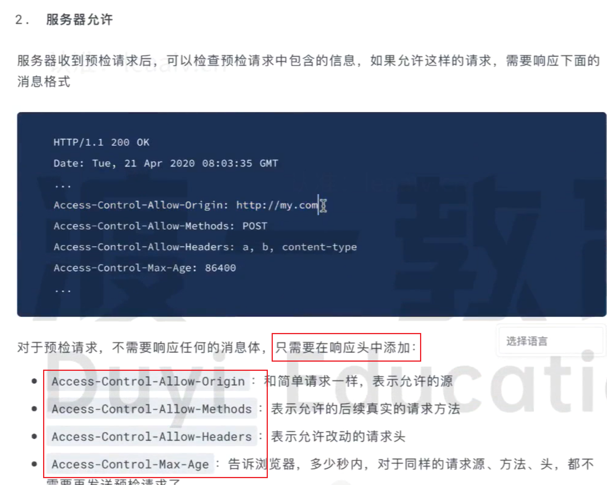
        * 3. 浏览器发送真实请求
            * 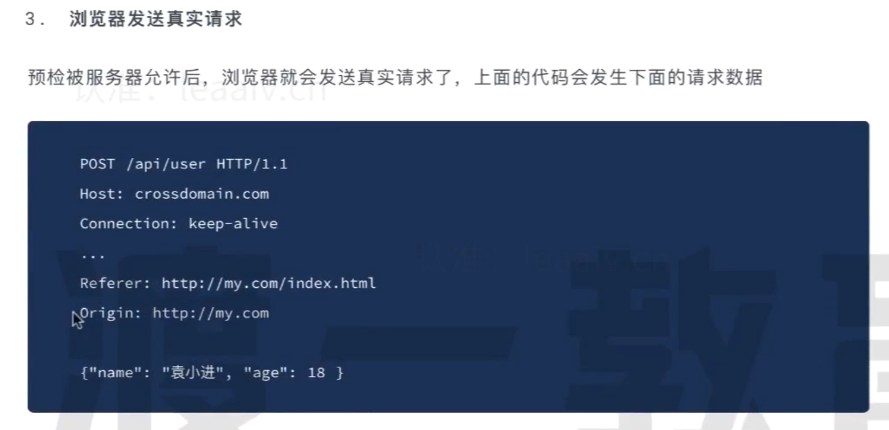
        * 4. 服务器完成真实的响应
            * 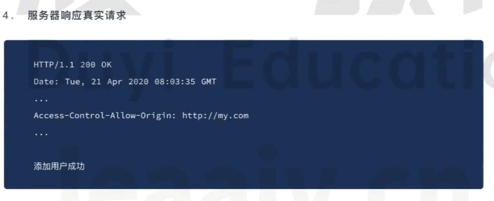
* 附带身份凭证的请求
    *  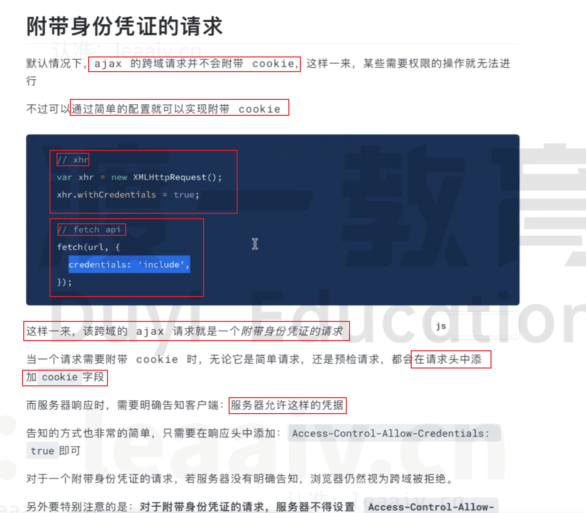
    *  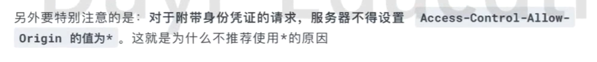
* 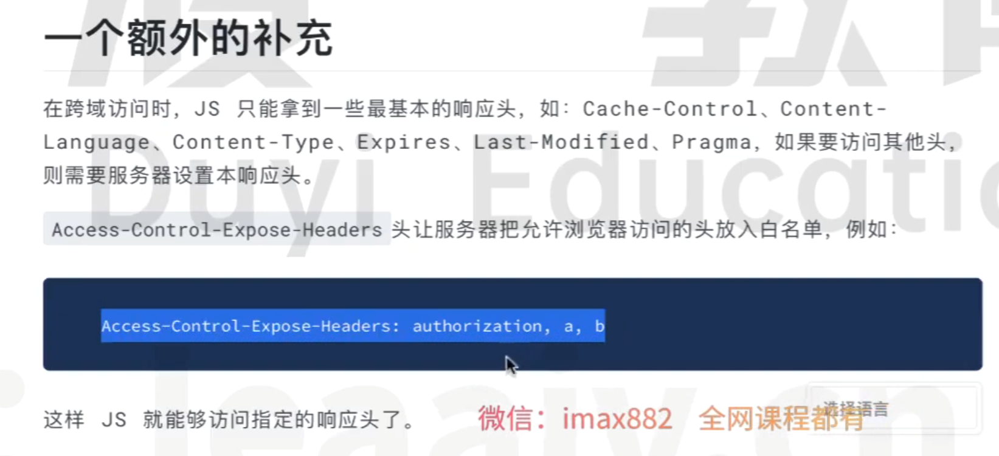

# 跨域-JSONP
* 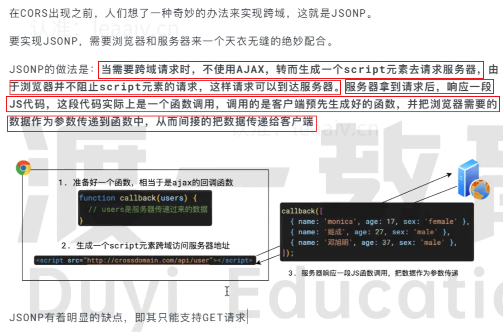